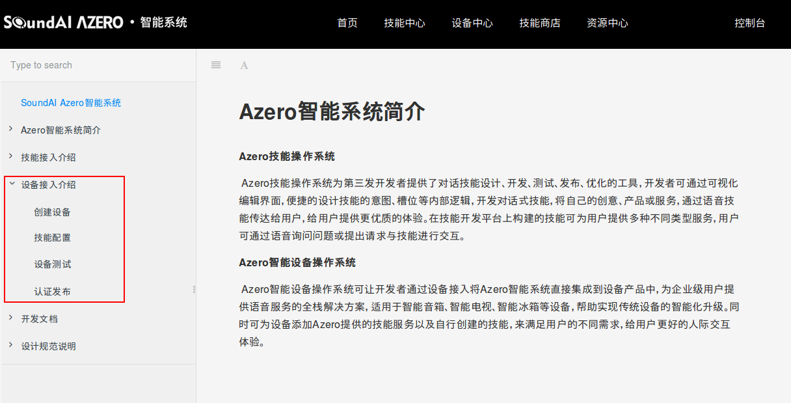

# Azero RTOS 新手运行说明

## 目录

* [说明](#Description)
* [下载](#Donwload)
* [工程结构](#Contents)
* [编译环境搭建](#Compiled)
* [示例运行](#QuickStart)

    

## 说明
此文档负责帮助大家在设备上运行示例，当前支持 FreeRTOS。输入数据格式要求为降噪后的 mono 16k 16bit （唤醒&降噪库外置）。

## 下载
* Github下载：https://github.com/sai-azero/Azero_SDK_for_RTOS/releases
* 网盘下载：

## 工程结构

* sai_config : 配置文件&资源文件目录
* include : Azero SDK的.h文件
* link-libs :  编译示例代码所需的依赖库，目录中分版本放置。
    * lib : Azero SDK库
    * 其它 ： 播放器外置，参见播放器操作api接口。
* demo : 示例代码
    * azeroSDK_service.c : 线程示例 azeroSDK_start();    其中示例播放器为uplayer，需要根据实际播放器修改；[ 播放器初始化入口为 azero_player_init() ]

## 编译环境搭建

可使用任意一种软件构建工具进行编译环境的搭建。

#### 环境要求 
* FreeRTOS V1.1及以上

  

## 示例运行
软件初始化时需要三个参数：clientId、productId以及device_SN(Device Serial Number)。其中，clientId、productId用以标识产品类别，device_SN用以标识个体设备。它们的获取方式如下：

**设备注册**
clientId、productId获取方法：
1. 登录到[Azero开放平台](https://azero.soundai.com)注册账号，账号需进行实名认证。
2. 接下来创建设备，请参考[设备接入介绍](https://azero.soundai.com/docs/document)进行设备注册。

3. 创建完毕后，在“**设备中心**->**已创建设备**”页面可以看到创建的设备，点击对应设备的“查看”进入设备信息页面，页面中的“产品ID”项对应的值即为productId；"Client ID"项对应的值即为clientId。
4. device_SN用来区分设备个体，保证每台唯一即可，一般可使用mac地址。

以上三个参数均在示例代码目录中的 azeroSDK_service.c 内使用 azero_set_device_info() 进行修改。

## 更多技能与进阶调优
* 更丰富的技能和个性化定制体验，请到[技能商店](https://azero.soundai.com/skill-store/all-skills)为设备配置官方或者第三方技能，也可以按照[技能接入介绍](https://azero.soundai.com/docs/document)创建自有技能，实现定制化需求。
* 若需将Azero SDK集成到您的工程，并针对您的设备进行唤醒、识别等语音交互效果的调优请参照进阶文档(暂未发布)。
